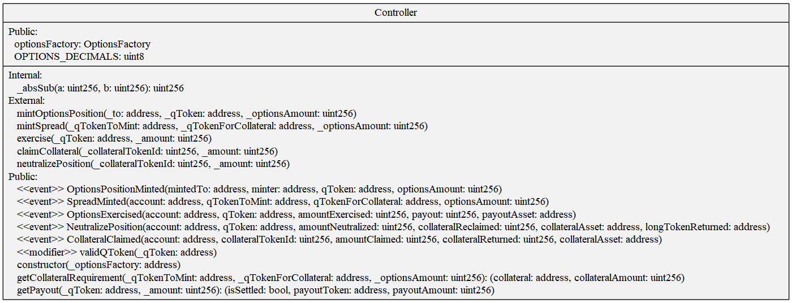

### getCollateralRequirement:

This is a public view function which calculates the amount of collateral required to mint an option or a spread. This method allows a relevant qToken to be used as collateral to mint another qToken to alleviate some of the collateral needed - known as a spread.

1. If the user is using another option as collateral (not the 0 address) check the following:

- Expiry of collateral qToken matches qToken to mint.
- Underlying asset of collateral qToken matches qToken to mint.
- Option type (Call or Put) of collateral qToken matches qToken to mint.
- Oracle of collateral qToken matches qToken to mint.

2. a) If the qToken being minted is a call (otherwise skip to 2b)

//TODO

- return { collateral: underlyingAsset, collateralAmount: }

2. b) If the qToken being minted is a put:

//TODO

### getPayout:

This is a public view function which calculates the payout an option (qToken) will receive if exercised.

1. If the option isn't settled, payout is 0 and flag for settled is false.
2. a) If the qToken to check payout for is a call (otherwise skip to 2b)

- If expiry price was lower than strike price, `payout = 0`
- Otherwise: `{payout = ((expiryPrice - strikePrice) / expiry) * optionsAmount, payoutToken = underlyingAsset}`

2. b) If the qToken to check payout for is a put

- If expiry price was higher than strike price `payout = 0`
- Otherwise: `{payout = ((strikePrice - strikePrice) * optionsAmount), payoutToken = strikeAsset}`

### mintOptionsPosition

The mint options position flow allows a user to mint an option (not a spread).

1. Modifier: Checks if the QToken to mint has been created i.e. valid. Also checks the QToken hasn't expired (can't mint expired options).
2. We check if the oracle is active in the oracle registry. If not, the method fails.
3. We calculate the collateral requirement for minting the option.
4. We transfer the collateral from the user to the controller.
5. We get the corresponding CollateralToken id to the QToken id. We mint both the option and the CollateralToken to the intended recipient (`_to` parameter passed in the method)

### mintSpread

//TODO

### exercise

The exercise flow allows a user to exercise options once they have expired. It must also be "Settled". By settled, we mean that the `PriceRegistry` has a price for this option as it has been submitted.

Note: If the `amount` param passed to this method is 0, it will exercise all the user's options.

1. We ensure the option is settled and get the payout amount.
2. We burn the options the user is exercising.
3. We payout the user if the payout is greater than 0.

### claimCollateral

The claim collateral flow allows an option minter (owner of CollateralToken) to reclaim any remaining collateral from the options mint after the option is settled.

Note: If the `amount` param passed to this method is 0, it will exercise all the user's collateral tokens.

//TODO

### neutralizePosition:

The neutralize position flow allows a user to "neutralize" some position in the following scenarios:

1. They have a qToken and the corresponding collateralToken with no option as collateral. In this scenario, they can receive all the collateral which was used to get the collateralToken since they have both sides of the position.
2. They have a qToken and a corresponding spread token (collateralToken with a long token as collateral). In this scenario //TODO
